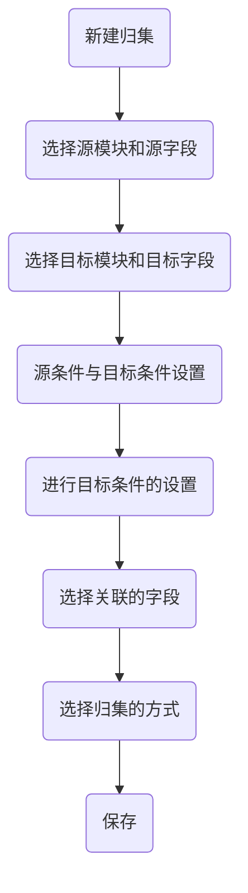
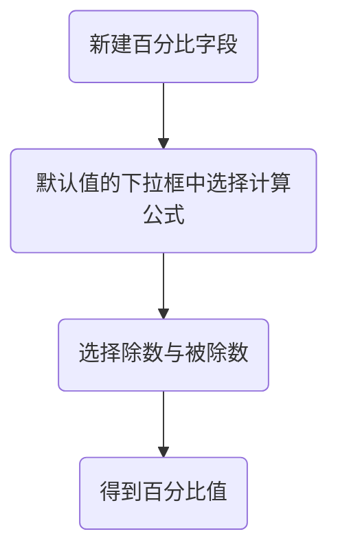
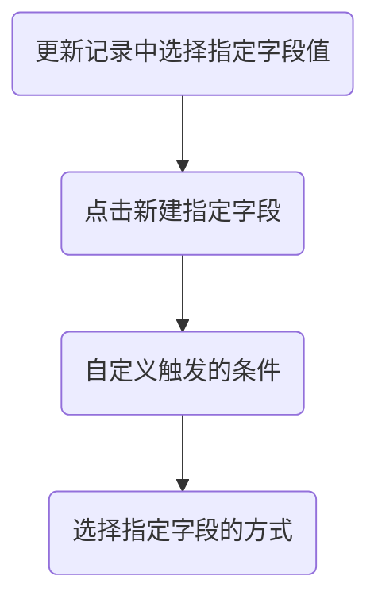

# 模块及说明

* 基础模块
  * 注册登录模块
  * 工作台模块
  * 业务跟进模块
  * 消息通知模块
  * 设置模块
    * 个人设置
    * 系统设置
    * 智能触发
* 列表模块
* 统计模块
* 高级设置模块（对列表模块进行 <font color='red'>**定制**</font> ）
* 打印模块
* 表单模块


## 基础模块

### 注册登录模块

#### 登录

1. 流程
   
   * 密码登录：输入账号与正确的密码后，选择所属的系统即可登录
     ```mermaid
     graph LR
     A(输入账号密码)-->B(选择所属系统)-->C(成功登录)
     ```
   * 短信登录：输入正确的手机号点击获取验证码后，选择所属的系统，并输入正确的验证码即可登录
   ```mermaid
     graph LR
     A(输入手机号)-->B(点击获取验证码)-->C(选择所属系统)-->D(输入验证码)-->E(成功登录)
   ```
   * 扫码登录：在登录界面，使用内账宝 App 在右上角找到扫一扫后，扫描屏幕二维码即可登录
   ```mermaid
     graph LR
     A(使用内帐宝App扫描登录二维码)-->B(在App点击登录)-->C(成功登录)
   ```


#### 注册

1. 流程

   * 申请试用：在登录页面点击 “**没有账号？申请注册**”后 ，在申请试用表单中填写信息（ <font color='red'>*</font> 必填），获取验证码后点击立即申请，后续会安排客服进行联系

     ```mermaid
     graph LR
     A(点击右下角的申请注册 )-->B(选择申请试用)-->C(填写正确信息)-->D(安排客服联系)
     ```
   * 注册账号：在登录页面点击“**没有账号？申请注册**”后 ，在注册账号表单中完善信息（ <font color='red'>*</font> 必填），获取验证码后点击立即注册，即可成功注册

     ```mermaid
     graph LR
     A(点击右下角的申请注册)-->B(选择注册账号)-->C(完善信息)-->D(成功注册)
     ```


#### 找回密码
1. 流程
   
   * 找回密码：在登录页面点击“**忘记密码**”后，在找回密码页面输入手机号获取验证码，然后在重置密码页面输入两次新的密码后，点击提交即可重置密码
     ```mermaid
     graph LR
     A(点击忘记密码)-->B(输入手机号获取验证码)-->C(输入两次新密码)-->D(成功重置密码)
     ```


### 工作台模块

#### 任务

1. 流程

   * 发布任务

     ```mermaid
     graph LR
     A(在文本框输入任务信息)-->B(填写负责人等信息)-->C(点击发布)-->D(成功发布任务)
     ```

2. 各部分功能

   * 文本框：在文本框中可以输入任务信息，可添加表情、图片、链接、通知的联系人、标签与快捷短语等
   * 负责人：点击负责人右侧的 “**放大镜**”，即可在单选框中选择负责人
   * 客户：点击客户右侧的 “**放大镜**”，即可在单选框中选择客户
   * 联系人：点击联系人右侧的 “**放大镜**”，即可在单选框中选择联系人
   * 待办：
     1. 勾选待办：表示该任务已完成，在日期框中可选择完成的时间
     2. 不勾选待办：表示该任务未完成，为待办的任务，在日期框中选择时间，并在响铃中设置提醒的时间，则在相应的时间系统会对负责人进行提醒。
   * 右上角齿轮：
     1. 导出：选择要导出的与任务有关的字段，即可导出任务的excel表格
     2. 设置关联模块：点击“**+**”号新建关联，选择引用的模块及查询的字段后，在下方关联业务中就可进行模块与字段的选择
   * 关联业务：在关联业务中可选择要关联的模块及模块的实体


#### 跟进

1. 流程

   * 发布跟进：

     ```mermaid
     graph LR
     A(在文本框上方选择跟进类型)-->B(在文本框输入跟进信息)-->C(填写负责人等信息)-->D(点击发布)-->E(成功发布任务)
     ```

2. 各部分功能

   * 跟进类型：在文本框上方可选择跟进的类型
   * 文本框：在文本框中可以输入任务信息，可添加表情、图片、链接、通知的联系人、标签、快捷短语与跟进进度等
   * 跟进进度：在跟进进度中可选择跟进进度的形式，在下方设置中可对该形式进行编辑
   * 客户：点击客户右侧的 “放大镜”，即可在单选框中选择客户
   * 联系人：点击联系人右侧的 “放大镜”，即可在单选框中选择联系人
   * 待办：
     1. 勾选待办：表示该任务已完成，在日期框中可选择完成的时间
     2. 不勾选待办：表示该任务未完成，为待办的任务，在日期框中选择时间，并在响铃中设置提醒的时间，则在相应的时间系统会对负责人进行提醒。
   * 右上角齿轮：
   
     1. 设置跟进类型：可对跟进类型进行添加、删除或移动
   2. 导入：在导入中选择正确的excel文件可进行跟进的批量导入
     3. 导出：选择要导出的与任务有关的字段，即可批量导出任务的excel表格
   4. 设置关联模块：点击“**+**”号新建关联，选择引用的模块及查询的字段后，在下方关联业务中就可进行模块与字段的选择
   * 关联业务：在关联业务中可选择要关联的模块及模块的实体


#### 审批

1. 流程：

   * 发布审批：

     ```mermaid
     graph LR
     A(在文本框上方选择审批类型)-->B(在文本框输入待审批的信息)-->C(填写审批人等信息)-->D(点击发布)-->E(成功发布审批)
     ```
     
   * 审批流程：
   
     ```flow
     st=>start: 下属发布审批
     cond=>condition: 上级领导审核
     conda=>condition: 设置下一审批人
     f=>end: 审批成功
     e=>end: 审批失败
     op=>operation: 重复流程
     
     st->cond
     cond(yes)->conda
     cond(no)->e
     conda(yes)->op
     op(left)->cond
     conda(no)->f
     ```


1. 各部分功能：
   * 审批类型：在文本框上方可选择审批的类型
   * 文本框：在文本框中可以输入待审批的信息，可添加表情、图片、链接、通知的联系人、标签、快捷短语等
   * 审批人：点击审批人右侧的 “**放大镜**”，即可在单选框中选择审批人
   * 关联客户：点击关联客户右侧的 “**放大镜**”，即可在单选框中选择要关联的客户
   * 关联联系人：点击联系人右侧的 “**放大镜**”，即可在单选框中选择联系人
   * 右上角齿轮:
     1. 设置审批类型：可对审批类型进行添加、删除或移动
     2. 导入：在导入中选择正确的excel文件可进行审批的批量导入
     3. 导出：选择要导出的与审批有关的字段，即可批量导出审批的excel表格
     4. 设置关联模块：点击“**+**”号新建关联，选择引用的模块及查询的字段后，在下方关联业务中就可进行模块与字段的选择
   * 关联业务：在关联业务中可选择要关联的模块及模块的实体


#### 动态

1. 流程

   * 发布动态：

     ```mermaid
     graph LR
     A(在文本框上方选择动态类型)-->B(在文本框输入待动态的信息)-->C(填写批阅人等信息)-->D(点击发布)-->E(成功发布动态)
     ```

2. 各部分功能

   * 动态类型：在文本框上方可选择动态的类型
   * 文本框：在文本框中可以输入待动态的信息，可添加表情、图片、链接、通知的联系人、标签、快捷短语等（个别动态类型如日报、周报等，不仅需要填写本期的总结，还要填写下期的计划）
   * 报告时间：可选择报告的时间周期
   * 批阅人：点击动态人右侧的 “**放大镜**”，即可在单选框中选择批阅人
   * 关联客户：点击关联客户右侧的 “**放大镜**”，即可在单选框中选择要关联的客户
   * 关联联系人：点击联系人右侧的 “**放大镜**”，即可在单选框中选择联系人
   * 右上角齿轮：
     1. 设置动态类型：可对动态类型进行添加、删除或移动
     2. 导入：在导入中选择正确的excel文件可进行动态的批量导入
     3. 导出：选择要导出的与动态有关的字段，即可批量导出动态的excel表格
   


#### 发布区


#### 工作台设置

1. 各部分功能
   * 显示设置：可对工作台左方的条目进行编辑
     1. 固定显示：对工作台左方的条目进行固定显示,
     2. 动态显示：对工作台左方的条目进行动态显示，即有相关通知时进行显示并标注通知数量，无通知时不显示
     3. 不显示：对工作台左方的条目进行固定不显示
   * 默认展开：点击相应的条目时，控制是否编辑发布功能展开
   * 排序：按住条目前面六个点，可以发现鼠标变为方向键，移动鼠标即可对条目进行排序
   * 自定义审批
     1. 选择模块：对自定义审批分类中的条目进行选择
     2. 批量审批：？
   * 添加待办：对自定义待办分类中的条目进行新建，可选择相应的模块并对数据进行筛选
   * 编辑：对当前条目进行编辑，可选择相应的模块并对数据进行筛选
   * 删除：删除相应的条目
   * 当前模板：可在下拉选项中选择一套已保存的设置模板
   * 新建模板：点击后可回到设置的初始状态，对设置进行配置后，点击保存即可保存为设置模板
   * 模板另存为：对当前的设置进行配置后，点击模板另存为后进行命名，点击保存即可保存为设置模板，原来的设置模板保持不变
   * 删除模板：对当前的设置模板进行删除
   * 应用到：对当前的设置模板进行人员的分配，不同的设置模板可分配给不同的人员


#### 常用功能


#### 消息通知


### 业务跟进模块

1. 各部分功能

   * 跟进列表：在跟进列表中可以看到有跟进的信息（具体的功能同工作台-跟进）
   * 跟进分类：在页面最左侧为跟进的分类，分类的对象是跟进列表
   * 新建跟进：具体的功能同工作台-跟进
   * 通讯录：
     1. 邀请同事：在邀请同事中可对同事进行邀请，邀请后会在通讯录中显示同事的名称
     2. 查看同事：在通讯录右上角点击查看后，可跳转通讯录的详情页面，如下图

   * 热门标签：
     1. 热门标签原理同分类，点击热门标签后，会将带有该标签的跟进分类出来
     2. 在管理标签页面可进行标签的管理，如新建、删除等

   * 我的日程:
     1. 待办列表：点击日期后可以可在下方的列表中显示该日的相关安排，如任务、跟进等
     2. 添加待办：点击添加待办后对待办的类型进行选择，选择后即可对待办进行添加操作（添加操作同工作台-待办-添加待办）
     3. 全部日历：
        1. 日历分类：左侧列表为日历中信息的分类，如点击人员 “测试”，那么将会在日历中显示测试
        2. 筛选：通过右上方的筛选可对信息进行筛选，也可结合左侧列表的分类进行组合筛选
        3. 新建：可选择新建待办或任务，原理同上


### 消息通知模块


### 设置模块

#### 个人设置模块

1. 各部分功能
   * 个人信息：个人信息页面展示了个人的基本信息，点击 **更多信息 **可展开如 QQ、生日等信息。在个人信息右上角点击 **编辑**，即可编辑个人信息与更多信息。（在账户金币右方点击 **兑换**，即可跳转到金币商城）
   * 修改头像：在点击 **上传头像** 后选择图片进行上传，用户可对已上传的头像进行切割选取，点击保存该头像后即头像上传成功
   * 修改密码：在输入原密码、新密码、确认新密码后，点击修改即可修改密码
   * 编辑二级密码：在输入原密码、新密码、确认新密码后，点击修改即可修改二级密码
   * 同步系统消息：在同步系统消息页面点击开始同步后，即可同步系统消息（效果同刷新页面）


#### 系统设置模块

用户权限

日志管理

金币打赏

支付配置

通讯配置

系统配置

外部表单

分类数据

版本信息


#### 智能触发模块

消息提醒

分配共享

记录样式

审批流程


## 列表模块（客户）

#### 客户页面

1. 各部分功能

   * 客户列表：在客户列表中，有全部、今日客户、正式用户、意向用户和我的客户的分类，根据所选择的不同，系统将按照客户类型对客户进行分类

   * 联系人列表：？

   * 搜索:

     1. 直接搜索：仅可以搜索搜索框内默认的字段（默认字段可在快速查询中修改）

     2. 快速查询：

        1. 单个查询：选择单个条件进行查询

        2. 组合查询：选择多个条件进行组合查询

        3. 快速查询设置：

           1. 已显示-默认查询字段：为直接搜索中可搜索的字段（最多可选择3个）

           2. 已显示区域中的字段：为快速查询中显示的条件

           3. 未显示区域中的字段：为已显示字段的备选字段，可以将此区域中的字段放到已显示区域中进行显示

           4. 保存到分类：将符合全部条件的信息命名后保存到新的分类中

   * 高级查询：高级查询可为用户提供带有逻辑判断的查询功能（高级查询的优先级大于分类，即在不同的分类中进行相同的高级查询，得到的数据相同）

   * 分类设置：分类即满足所有分类条件后的信息
     1. 已显示：在页面中显示出的分类

     2. 已显示中字段的设置
        1. 修改：可进行当前分类的修改
        2. 删除：可删除当前的分类
        3. 复制：可将当前的分类进行复制，复制到当前已显示区域
        4. 设置默认：选择一个分类后将该分类设置为默认分类，效果为当用户一开始进入客户页面时，未设置前见到的是未被分类的全部信息，设置后见到的是设置为默认分类的信息

     3. 未显示：未显示区域中的字段与已显示区域中的字段操作同理，为已显示区域的备选，可进行拖拽调整

     4. 模板：所要展示的分类合集可看做一个分类模板

        1. 在下拉框中可以进行模板的切换

        2. 新建模板：在新建模板中可以选择现有的分类进行展示，在设置模板名称后点击确认进行保存

        3. 模板另存为：对当前模板修改后，点击模板另存为，效果是不对当前模板进行修改，并新建一个修改后的模板

        4. 删除模板：效果为删除模板

   
   * 列显示设置：所要展示列表的表头信息可看做一个列显示模板
     1. 切换列显示的模板
     2. 编辑列显示的模板
        1. 已显示：为已经显示在页面的列表字段（表头）
        2. 未显示：可将字段放入已显示区域中进行显示
        3. 列表显示名称：可对模板进行重命名
        4. 应用到用户：可将模板分配到不同的用户上
     3. 删除列显示的模板
     4. 添加列表显示为新建列显示模板
   * 排序:
     1. 简单排序：点击列的表头即可让数据进行排序
     2. 组合排序：组合排序中排序的对象是现有的列表头
   * 列表字段宽度的修改：拖拉表格的分隔符可调整表格列的宽度
   * 数据的分页及页面的跳转：
     1. 页面每页显示10条数据，可点击下拉框进行修改（最多80条最少10条）
     2. 在跳转框中输入所要跳转的页面后，点击跳转即可到达所需要的页面


####  新建客户

1. 各部分功能

   * 新建：输入客户的信息后保存即可
   * 检查重复：功能为对当前已输入的每个字段进行查重
   * 保存并打开：保存后立即打开该客户详情
   * 导入客户：
     1. 导入客户的第一步是参照excel模板，否则将无法进行字段的映射
     2. 上传文件后，选择excel文件中所要导入的工作表
     3. 在字段映射中，选择要映射的字段，如excel表头字段的公司名称可以作为系统字段的客户名称进行导入
   * 导出客户：
     1. 导出选中记录：为用户勾选的记录
     2. 导出查询出记录：为用户查询后在页面显示出的记录（如有多页，也包含未能显示出的记录）
     3. 导出全部：为全部的记录（与是否分类或是否查询无关）
   * 选择客户（单选）：
     1. 打开：单选客户并打开，显示客户详情
     2. 编辑：单选客户并编辑，跳转到客户编辑页面
     3. 分配：分配指的是将记录分配到他人名下（改变记录所属用户）
     4. 共享：共享与分配不同的是，共享不改变记录所属用户，但可让其他人查看到此记录
     5. 回收：回收指的是将共享出去的用户回收回来，即取消共享
     6. 删除：在删除中可选中所需要删除的相关项。选择客户并选中相关项进行删除后，客户的数据将被删除
     7. 删除操作中：
        1. 选中删除的相关项：使用了该客户数据的相关项将被删除
        2. 未选中的相关项：即使关联了该客户的数据，但关联的数据不会被删除，点击客户数据显示 ”您要查看的记录不存在或已被删除“
     8. 查重：在选中查重的字段后，可选择需要查重的范围
        1. 查询后的记录数：即经过分类或查询后的所有记录
        2. 当前页选中的记录数：即用户自己勾选的记录
     
     9. 复制：在选中单个客户后，点击复制，在复制客户页面可以进行相应的修改，修改后点击保存即可新建客户
   
   * 选择客户（多选）：
     1. 多选批量修改客户：在批量修改页面，选择要修改的字段，字段修改的方式，及字段修改的内容后，点击确定即可进行字段的批量修改


## 统计模块


## 高级设置模块

### 模块管理

### 更新记录

字段值归集

创建记录

进度管理

布局管理

系统配置

消息提醒

分配共享

记录样式


## 打印模块


## 报表模块

### 报表页面

1. 各部分功能
   * 进入报表页面：设置-高级设置-模块-模块管理-点击相应的模块-布局设计器-报表布局-操作-编辑布局（若无现有的报表则新建）
   * 布局设计：显示表单的编辑内容
   * 表单设置：编写业务规则（添加业务规侧可以规范化表单数据录入。当满足条件时，显示、隐藏、更改字段属性或提示错误。可以控制表单或表单里面的值）
   * 更多：
     1. 导出布局JSON：将当前的布局模板进行导出，导出为JSON文件
     2. 导入布局JSON：将当前的布局模板进行导入，导入JSON文件（JSON文件必须为导出的布局模板JSON文件）
   * 清空：将布局设计中的编辑内容、数据源的内容与页面变量中的变量全部清空
   * 预览：将当前的布局进行渲染后，即可预览（有些布局内容只能渲染后才能看到，如markdown控件中使用的公式等）
   * 另存为：对信息进行编辑后，将当前布局的模板另存到布局设计器中的报表布局中，另存以后，对当前布局进行编辑后保存即对另存后的布局进行编辑后保存
   * 保存：对当前的布局进行保存
   * 控件：控件是布局设计中的主要内容，点击或拖动控件即可将控件放入布局设计中
   * 数据源：如下
   * 页面变量：如下


### 报表默认属性

1. 各部分功能
   * 属性：
     1. 表单
        1. 标题：对标题内容进行编辑
        2. 描述：在标题旁加上 “i” 符号，当符号移动到该符号后，可出现描述的内容
     2. 字段属性
        1. 状态：对标题进行显示控制
        2. 提交按钮：？
        3. 标题内容是否换行：控制控件的标题，对控件的标题是否换行进行控制
     3. 标题样式（需状态中进行标题的显示后才可见）
        1. 字体大小：控制标题的字体大小
        2. 字体颜色：控制标题的字体颜色
        3. 字体加粗：控制标题的字体加粗
        4. 字体斜体：控制标题是否进行斜体
        5. 字体下划线：控制标题是否加上下划线
        6. 间距：控制标题每个字的间距
     4. 全局样式:
        1. 主题配色：控制全部控件标题的字体颜色
     5. 其他设置:
        1. 子控件外边距：对控件上下间的间距进行设置
   * 高级
     1. 主数据源：？
     2. 事件：如下


### 控件基本属性

1. 各部分功能
   * 文本框：
     1. 名称：在下拉框中可以选择实体的字段（<font color='red'>**选择绑定的字段**</font>）
     2. 标题：可对标题内容进行编辑
     3. 占位符：即文本框中默认的浅灰体文字，起提醒作用
     4. 描述：在标题旁加上 “i” 符号，当符号移动到该符号后，可出现描述的内容
     5. 显示控件：对控件在预览中是否显示进行控制
     6. 禁止打印：效果为演示页面中进行打印操作，禁止打印的控件不会出现在打印页面中去，即该控件被过滤掉
     7. PDF查询组件：将组件设置为pdf查询的组件，效果为在报表演示页面最上方将控件进行展示（不为预览页面，演示页面为ocq主页面中，菜单绑定的布局）
   * 字段属性
     1. 状态：
        1. 显示标题：控制控件的标题是否进行显示
        2. 新建只读：控件中的内容不可编辑
        3. 编辑只读：控件中的内容可编辑，但保存不了，如果有默认值则回到默认值
     2. 前缀文本：对文本框加上默认的前置内容
     3. 后缀文本：对文本框加上默认的后置内容
     4. 默认值：
        1. 自定义：对文本框加上默认的内容，未输入即可默认显示的内容
        2. 公式编辑：可以编辑公式（之前没用是因为没有将控件绑定字段，也就是对控件的名称进行绑定）
        3. 数据联动：？
     5. 必填：控件标题前加上*，为必填选项，不填的话打印后文本框会变红
   * 验证
     1. 长度：对控件的内容进行长度的验证
     2. 规则：对控件的内容进行已有的规则验证
   * 占位宽度：对控件在布局设计中的宽度进行控制
   * 标题样式
     1. 字体大小：控制控件标题的字体大小
     2. 字体颜色：控制控件标题的字体颜色
     3. 字体加粗：控制控件标题的字体加粗
     4. 字体斜体：控制控件标题是否进行斜体
     5. 字体下划线：控制控件标题是否加上下划线
     6. 间距：控制控件标题每个字的间距
     7. 标题对齐方式：控制控件标题的对齐方式
   * 内容样式
     1. 字体大小：控制控件内容的字体大小
     2. 字体颜色：控制控件内容的字体颜色
     3. 字体加粗：控制控件内容的字体加粗
     4. 字体斜体：控制控件内容是否进行斜体
     5. 字体下划线：控制控件内容是否加上下划线
     6. 间距：控制控件内容每个字的间距
     7. 标题对齐方式：控制控件内容的对齐方式
   * 其他设置
     1. 控件占高：控制控件的显示高度

### 常用控件

1. 各部分功能
   * 文本
     1. 格式：暂时无效
   * 多行文本
     1. 行数：即文本框所显示的行数
   * 数值
     1. 小数定义：可自定义小数位
   * 金额
     1. 小数定义：可自定义小数位
     2. 货币单位：可设置货币的单位（暂时无效）
   * 百分比
     1. 格式：暂时无效
   * 邮箱
   * 手机
   * 时间
   * 日期时间
     1. 验证：对所选择的时间进行验证
   * 单选
     1. 选项类型：
        1. 自定义选项：可对选项的显示值与选项值进行编辑
        2. 数据源选项：适用于**下拉类**数据源
   * 多选
     1. 选项类型：
        1. 自定义选项：可对选项的显示值与选项值进行编辑
        2. 数据源选项：适用于**下拉类**数据源
        3. 另一个数据源选项：意思位自定义选项可与数据源选项同时存在，同时被选择
   * 下拉单选
     1. 选项类型：
        1. 自定义选项：可对选项的显示值与选项值进行编辑
        2. 数据源选项：适用于**下拉类**数据源
   * 下拉多选
     1. 选项类型：
        1. 自定义选项：可对选项的显示值与选项值进行编辑
        2. 数据源选项：适用于**下拉类**数据源
   * 附件
     1. 按钮文本：可对按钮的文本进行编辑
   * 图片
     1. 按钮文本：可对按钮的文本进行编辑
     2. 允许拍照：图片的上传只允许使用拍照
     3. 允许上传：图片的上传可以使用文件上传
   * 定位
   * 区域
     1. 数据源选项：定死的分类
   * 引用
     1. 数据源选项：适用于**实体类**数据源
   * 多选引用
     1. 数据源选项：适用于**实体类**数据源
   * 级联
     1. 数据源选项：适用于**分类**数据源


### 高级控件

1. 各部分功能

   * 自动编号
   * 工商查询
     1. 工商映射：选择工商后，将工商的信息映射到报表中的控件中
   * 手写签名
   * Markdown
     1. 编辑：可对Markdown文档中的内容进行编辑
     2. 清空：可对Markdown文档中的内容进行清空

   


### 布局控件

1. 各部分功能

   * 分组：功能为将组件放到分组围起来的特定的区域，并在区域上方加上标题

     1. 默认展开：该区域默认为展开
     2. 允许折叠：控制该区域是否允许折叠

   * 分栏：功能与分组一样，只不过增加了分栏的选择

     ​	1. 分栏选项：可对分栏进行增加即删除，点击分栏可对分栏进行重命名与默认分栏显示

   * 明细表单：？

   * 栅格容器：与分组不同的是可以自定义列宽与自定义的排版

     1. 布局：在布局中可选择控件排版的布局，在布局中，可将控件放入布局
     2. 列比例：在列比例中可对当前的布局进行各个列的宽度比例配置
     3. 背景图片：在布局的底部加上背景的图片
     4. 背景尺寸：设置背景图片的尺寸

   * 内嵌网页

     1. 网页地址：输入网页地址可在报表中显示网页


### 图像控件

> 图像控件的数据源必须是实体
>
> 属性-分页符：若一个控件的分页符选项，选择在前面插入，则在控件前面进行分页，表现为该控件在打印时会被放在最上方

1. 各部分功能
   * 表格：
     1. 数据：
        1. 选择数据集：只能选择实体类的数据源
        2. 选择列字段：将实体的字段放到表格中，为列表头
        3. 字段设置：
           1. 计算：
              1. 排序：需将字段设为分组列后，才能使用该排序
              2. 聚合操作：？
              3. 分组列：？
              4. 统计：对数值类型的数据进行统计，放在表格的最下方（若不为数值类型）
           2. 格式化：
              1. 基础：对内容进行格式设置
              2. 前后缀：对内容进行前缀后缀的添加操作
              3. 空值替换：替换前为null或空字符串的内容，将这些内容进行替换
           3. 表格列：
              1. 文本颜色：将该字段所在的列，列的内容的文本字体进行设置
              2. 列背景色：将该字段所在的列，列的背景颜色进行设置
              3. 对齐方式：将该字段所在的列，列的内容进行对齐
              4. 列宽：没用？
              5. 表头提示：没用？
              6. 隐藏列：对列进行隐藏
              7. 是否加密：效果为将表格的数据显示为 ***
              8. 最大换行行数：？
           4. 条件样式：？
           5. 其他：可修改表格标题的内容
        4. 选择排序：对表格的数据进行排序，按一定的字段排序，该字段可不显示在表格中（选择排序的优先度大于字段编辑里面的排序）
        5. 条件过滤：没用？
     2. 样式
        1. 分页设置
           1. 显示：控制表格最下方分页的显示与否
           2. 分页条数：控制表格分页的条数，达到条数后即进行分页
           3. 位置：控制分页的对齐方式
           4. 简单分页：即没有页码、快捷跳转与条目统计，只有上下页
           5. 页码切换：？
        2. 整体
           1. 展示模式：可切换表格的显示模式
           2. 固定列：？
   * 柱状图
     1. 数据：
        1. 选择数据集：只能选择实体类的数据源
        2. 分类依据：柱状图将对该依据进行分类（如按照门店的营业情况进行分类，分营业中和停业中）（多个分类的依据可在柱状图下方切换分类的依据）
        3. 统计数据：相当于按分类依据分类后，对各个分类进行统计，统计的为该统计的依据（如统计依据为经营天数，那么就统计营业中的门店的经营天数）
        4. 字段设置：
           1. 计算：该排序无效
           2. 格式化：
              1. 前后缀：对分类依据的文本进行添加前后缀
              2. 空值替换：替换前为null或空字符串的内容，将这些内容进行替换（是否是对分类依据的文本？）
        5. 选择排序：对柱状图的统计依据字段进行排序（当然不在统计依据中的字段也可以进行排序）
        6. 条件过滤：
     2. 样式
        1. 样式配置：
           1. 高度：对柱状图的整体高度进行设置
           2. 支持导出：将柱状图导出为svg文件（svg为矢量图形文件）
           3. 支持刷新：在预览页面中，柱状图的右上角会有刷新按钮
        2. X轴
           1. 刻度显示：将X轴中的刻度进行显示
           2. 轴线显示：将X轴进行显示
           3. 网络格：控制X轴网络格的显示
           4. 标签显示（X轴下方的标签）
              1. 颜色：控制数据标签的字体颜色
              2. 大小：控制数据标签的字体大小
        3. Y轴
           1. 刻度显示：将Y轴的刻度进行显示
           2. 轴线显示：将Y轴进行显示
           3. 网络格：控制Y轴网络格的显示
           4. 标签显示
              1. 颜色：控制数据标签的字体颜色
              2. 大小：控制数据标签的字体大小
        4. 数据标签（柱状图最中间的标签）
           1. 显示：控制数据标签的显示
           2. 大小：控制数据标签的大小
           3. 位置：无效
   * 折线图
     1. 数据：与柱状图一样
     2. 样式：与柱状图一样
   * 饼图
     1. 数据：与柱状图一样
     2. 样式：
        1. 环形图：将饼状图更改为环形图
        2. 数据标签
           1. 连接线：将位置为外部的标签与饼图进行链接
           2. 位置：更改标签的位置
           3. 大小：更改数据标签的大小
   * 仪表盘
     1. 数据
     2. 样式
        1. 圆角：控制仪表盘底部是否圆角收尾
        2. 显示指针：仪表盘是否显示指针
        3. 色条粗细：控制仪表盘最外部那一圈的粗细
        4. 相对半径：
        5. 相对内半径：
        6. 刻度显示：控制刻度是否进行显示
        7. 最小值：控制刻度的最小值
        8. 最大值：控制刻度的最大值
   * 漏斗图（有什么用）
     1. 数据：与柱状图一样（将统计数据进行排序，大的在上面）
     2. 样式：
        1. 动态高度：无效
        2. 水平布局：无效
   * 指标卡：这有啥用？（一般用在移动端）


### 其他控件

1. 各部分功能
   * 标签：功能为一个小标题
   * 按钮：
     1. 按钮文本框：可编辑按钮的文本
   * 展示图片：暂时无效
     1. 展示图片：点击上传后可上传展示的图片
     2. 显示格式：可进行图片格式选择
     3. 图片宽度：可对图片的宽度进行设置
     4. 图片高度：可对图片的高度进行设置
   * 条码：
     1. 类型：可选择条码的类型，有二维码与条形码
     2. 内容：编辑内容可生成条码，扫描条码可获取该内容


### 数据源

1. 各部分功能：

   * 下拉类数据源
     1. 实体：选择实体
     2. 栏位：下拉类数据源的栏位为实体中的单选、多选字段
   * 分类数据源
     1. 分类：选择的分类为设置中分类依据中的分类
   * 实体类数据源（常用）
     1. 实体：可选择表
     2. 栏位：将表的字段拿出来
        1. 控件中：随意拿都行，控件可以拿全部的表数据
        2. markdown中：在markdown中因为要放代称，不是字段名，所以没在栏位中的数据markdown拿不到
     3. 配置：设置主显字段（有什么用？）
     4. 筛选：对数据进行筛选
   * 第三方服务类数据源（现成的，怎么用？）
     1. 请求地址
     2. 请求方法
     3. 请求参数
     4. 数据响应
   
   

### 页面变量


### Markdown相关

1.要想在markdown中引用数据源，前提条件是报表布局的名称不能有中文


### 事件


# 部分解决流程

### 待分类

1.一张表上多个数据归集到一个数据上



有多个数据关联到一个相同的a字段上， 现将这多个数据归集到这一条信息的 a字段上（如在店员表中有多个店员，这多个店员都在同一个门店中）（计算可以是对信息进行统计、对信息中的数字进行总和等）


例：将门店手下的离职员工数量做个统计，统计到门店离职人数这个字段上

1. 源模块选店员，源字段选是否离职（源模块的源字段统计到目标模块的更新字段上）
2. 目标模块选门店，更新字段选离职人数
3. 源条件为店员的是否离职字段为离职，这样就把离职的人员筛选了出来（源条件是筛选源字段后，才进行归集）
4. 目标条件不选（可以这么用，可以选当门店经营状况为营业中时才去统计该门店的离职人数，效果为当门店为停业中时，修改该门店手下的员工小a为离职，门店的离职率不变）
5. 关联字段选所属的门店（归集首先得有关联的字段，也就是引用字段才能进行归集操作，在这里的意思是相同门店离职的店员做一个统计，统计到该门店离职人数这个字段上）
6. 选择归集的结果：目标字段值选源字段-->数量（因为为统计离职店员的人数）
7. 保存即可


2.一条数据中的日期字段距今已多少天


1. 新建数字字段
2. 在默认值的下拉框中选择计算公式
3. 点击设置公式，点右上角的编辑
4. 在右下角的函数选择中选择日期之间的相减值datediff()
5. 将今日日期与被减日期做减法，得到指定的日期格式（如“d”为天）


3.一张表上根据多个字段值的条件来计算百分比



1. 新建百分比字段
2. 在默认值的下拉框中选择计算公式
3. 选择除数与被除数（除数可以是这条数据中的多个字段，被除数同理）
4. 该字段可得到计算后的百分比值


4.一张表上根据多个字段值的条件来指定字段



1. 更新记录中选择指定字段值
2. 选择被指定的字段
3. 选择右上角的触发条件（重要，可以自定义触发条件）
4. 选择指定字段的方式（为单选类型，或其他字段的单选类型）
5. 该字段可得到相应条件下指定字段的值


### 报表

1. 将日期控件放在开头进行数据筛选
   1. 新建时间日期控件并绑定要筛选的字段
   2. 

​                                       
