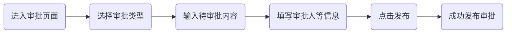

**目录：**

[TOC]

# 1. 注册登录

## 1.1 注册 OCQ 账号

### 1.1.1 申请试用

**演示：**

**步骤：**

1. 在登录页面中，点击申请注册
2. 在申请试用页面中，填入企业名称及姓名
3. 填入手机号点击获取验证码，输入验证码
4. 点击立即申请后，届时会有客服人员尽快与您联系

### 1.1.2 注册账号

**演示：**

**步骤：**

1. 在登录页面中，点击申请注册
2. 在申请试用页面中，完善相关信息
3. 填入手机号点击获取验证码，输入验证码
4. 点击立即注册后，即成功注册

## 1.2 登录 OCQ 

### 1.2.1 密码登录

**演示：**

**步骤：**

1. 在密码登录页面，输入手机号或邮箱，并输入密码
2. 选择所属的系统
3. 点击登录，即可成功登录

### 1.2.2 短信登录

**演示：**

**步骤：**

1. 在短信登录页面，输入手机号并点击获取验证码
2. 输入验证码
3. 选择所属的系统
4. 点击登录，即可成功登录

### 1.2.3 扫码登录

**演示：**

**步骤：**

1. 手机上打开内帐宝 App ，点击右上角的三个点
2. 点击扫一扫功能
3. 使用手机扫描扫描登录界面的二维码
4. 在手机上点击登录，即可成功登录

## 1.3 找回密码

**演示：**

**步骤：**

1. 在密码登录页面，点击忘记密码，跳转到找回密码页面
2. 在找回密码页面，输入手机号或邮箱
3. 点击获取验证码
4. 输入正确的验证码
5. 点击提交，跳转到重置密码页面
6. 在重置密码页面，输入新的密码
7. 第二次输入新的密码
8. 点击保存，即可成功重置密码

# 2. 工作台

## 2.1 任务

### 2.1.1 发布任务

**流程：**

**演示：**

**步骤：**

1. 在首页的工作台中，点击任务，进入任务页面
2. 在文本框中输入任务内容
3. 指定一个负责人，必填（**注：**点击右侧的 "放大镜" 进行选择）
4. 填写客户、联系人、待办、提醒和关联业务，可不填
5. 点击发布，即可成功发布任务

**效果：**

 

**效果说明：**

1. 点击客户等信息，会跳转到相应的详情页
2. 若设置了提醒，则会在相应的时间提醒负责人

### 2.1.2 查看任务

## 2.2 跟进

### 2.2.1 发布跟进

**流程：**

**演示：**

**步骤：**

1. 在首页的工作台中，点击跟进，进入跟进页面
2. 选择一个跟进的形式
3. 在文本框中输入跟进的内容
4. 指定跟进的客户与联系人（**注：**点击右侧的 "放大镜" 进行选择）
5. 填写待办、提醒、完成时间和关联业务，可不填
6. 点击发布，即可成功发布跟进

**效果：**

 

**效果说明：**

1. 点击客户等信息，会跳转到相应的详情页

### 2.2.2 查看跟进

## 2.3 审批

### 2.3.1 发布审批

**流程：**

**演示：**

**步骤：**

1. 在首页的工作台中，点击审批，进入审批页面
2. 选择一个审批的形式
3. 在文本框中输入需待审批的内容
4. 指定一个审批人（**注：**点击右侧的 "放大镜" 进行选择）
5. 填写关联客户和关联联系人，可不填
6. 点击发布，即可成功发布审批

**效果：**

 

**效果说明：**

1. 点击关联客户等信息，会跳转到相应的详情页

### 2.3.2 查看审批

## 2.4 动态

### 2.4.1 发布动态

**流程：**

**演示：**

**步骤：**

1. 在首页的工作台中，点击动态，进入动态页面
2. 选择一个动态的形式
3. 在文本框中输入动态的内容
4. 选择报告时间并指定批阅人（**注：**点击右侧的 "放大镜" 进行选择）
6. 点击发布，即可成功发布动态

**效果：**

 

### 2.4.2 查看动态

# 3. 自定义导航栏

> 导航栏也称为菜单栏

### 3.1 配置菜单栏

**演示：**

**步骤：**

1. 添加主菜单
2. 添加子菜单

### 3.2 关联菜单栏

**演示：**

**步骤：**

1. 选择一个菜单或子菜单
2. 选择关联的类型
3. 选择关联的模块、布局等

**效果：**

**效果说明：**

1. 在导航栏中点击菜单后，会跳转到设置好的关联模块中

## ---

**橘色字体**

**注：**